# Graphs Toolkit

<div align="center">

  Idiomas:

  [](README.pt-br.md)
  [](README.en.md)

</div>

&nbsp;

&nbsp;&nbsp;&nbsp;&nbsp;Representação da estrutura de dados `grafo` por meio de `lista de adjacência`.

&nbsp;&nbsp;&nbsp;&nbsp;Estrutura implementada inteiramente em `Dart` com métodos de inserção e exclusão de vértices e arestas para criação e manipulação de grafos orientados e não orientados.

&nbsp;

Conteúdo

- [O que é um Grafo](#o-que-é-um-grafo)

  - [Orientado](#orientado)
  - [Não Orientado](#não-orientado)

- [O que é um Vértice](#o-que-é-um-vértice)

- [O que é uma Aresta](#o-que-é-uma-aresta)

- [Métodos Básicos de um Grafo](#métodos-básicos-de-um-grafo)

  - [GetV](#getv)
  - [Adicionar Vértices do Modo Básico](#adicionar-vértices-do-modo-básico)
  - [Adicionar Vértices com _addVertex_](#adicionar-vértices-com-addvertex)
  - [Exclude Vertex](#excluir-um-vértice)
  - [First](#first)
  - [Last](#last)
  - [Has Cycle](#has-cycle)
  - [Breadth First Search - Bfs](#breadth-first-search---bfs)
  - [Depth First Search - Dfs](#depth-first-search---dfs)

- [Métodos de um Grafo Orientado](#métodos-de-um-grafo-orientado)

  - [Num of Edges](#num-of-edges)
  - [Get all Edges](#get-all-edges)
  - [Is Strongly Connected](#is-strongly-connected)
  - [Is DAG](#is-dag)
  - [To String](#to-string)
  - [PrintGraph](#printgraph)

- [Métodos de Grafo Não Orientado](#métodos-de-um-grafo-não-orientado)

  - [Num of Edges](#num-of-edges-1)
  - [Get all Edges](#get-all-edges-1)
  - [Is Connected](#is-connected)
  - [Is Tree](#is-tree)
  - [Is Forest](#is-forest)
  - [To String](#to-string-1)
  - [PrintGraph](#printgraph-1)

- [Métodos de um Vértice](#métodos-de-um-vértice)
  - [Add Edge](#add-edge)
  - [Exclude Edge](#exclude-edge)
  - [Vertices of Edges List](#vertices-of-edges-list)
  - [Is Sinkhole](#is-sinkhole)
  - [Is Generator](#is-generator)
  - [Entry Degree](#entry-degree)
  - [Exit Degree](#exit-degree)

&nbsp;

## **O que é um Grafo**

&nbsp;&nbsp;&nbsp;&nbsp;Um grafo é uma estrutura de dados composta por dois elementos, um conjunto de vértices ([ver definição](#o-que-é-um-vértice)) e um conjunto de arestas ([ver definição](#o-que-é-uma-aresta)). Podem ser do tipo orientado ([ver definição](#orientado)) ou não orientado ([ver definição](#não-orientado)).

&nbsp;

### **Orientado**

&nbsp;&nbsp;&nbsp;&nbsp;Grafos orientados, também conhecidos por digrafos, são aqueles nos quais as suas arestas possuem um sentido definido, ou seja, de um vértice `u` pode-se chegar em `v` mas oposto não ocorre, não há uma relação simétrica. Graficamente podem ser representados da seguinte forma:

&nbsp;

<p align="center">
  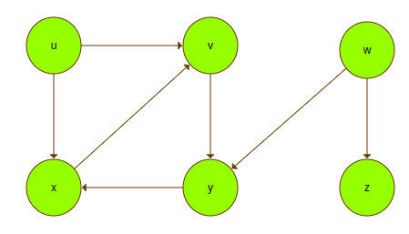
</p>

&nbsp;

&nbsp;&nbsp;&nbsp;&nbsp;Já que possuem um sentido definido, podem os seus vértices podem ter arestas que saem e chegam neles mesmos:

&nbsp;

<p align="center">
  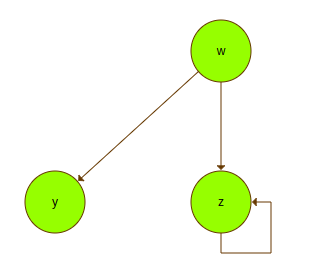
</p>

&nbsp;

### **Não Orientado**

&nbsp;&nbsp;&nbsp;&nbsp;Grafos não orientados são aqueles nos quais as suas arestas não possuem um sentido definido, pode-se ir tanto de `u` para `v` quanto de `v` para `u`, ou seja, ocorre a relação de simetria. Graficamente podem ser representados da seguinte forma:

&nbsp;

<p align="center">
  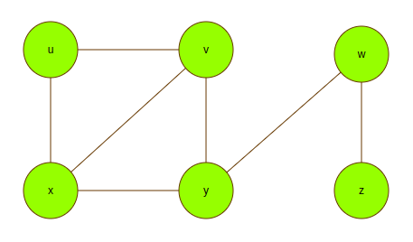
</p>

&nbsp;

## **O que é um Vértice**

&nbsp;&nbsp;&nbsp;&nbsp;Um vértice, também conhecido por nó, e a unidade fundamental para a composição de um grafo. A partir das suas composições com arestas muitos problemas podem ser resolvidos através da sua modelagem. No caso da implementação deste _`package`_, um vértice possui um identificador para diferenciá-lo dos demais, representado pelo atributo `label`. Pode armazenar um valor numérico em `value` e possui uma lista de arestas nos quais indica com quais outros vértices este está conectado.

&nbsp;

<p align="center">
  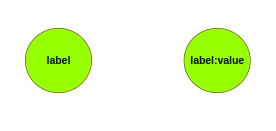
</p>

&nbsp;

&nbsp;&nbsp;&nbsp;&nbsp;Caso um `value` não seja definido inicialmente, nesta implementação ele terá o valor `0`.

&nbsp;

## **O que é uma Aresta**

&nbsp;&nbsp;&nbsp;&nbsp;Uma aresta tem a função de conectar dois vértices além de definir de qual tipo um grafo será, orientado ou não orientado.

&nbsp;&nbsp;&nbsp;&nbsp;Arestas orientadas possuem um sentido definido, ou seja, há somente um caminho a ser seguido:

&nbsp;

<p align="center">
  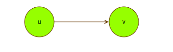
</p>

&nbsp;

&nbsp;&nbsp;&nbsp;&nbsp;Arestas não orientadas não possuem um sentido definido, podendo conectar dois vértices no sentido de ida e volta:

&nbsp;

<p align="center">
  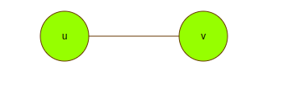
</p>

&nbsp;

&nbsp;&nbsp;&nbsp;&nbsp;Em ambos os tipos, as arestas podem armazenar um peso numérico:

<p align="center">
  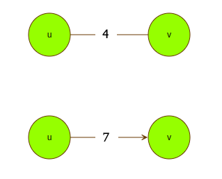
</p>

&nbsp;

&nbsp;&nbsp;&nbsp;&nbsp;Caso um peso não seja passado, nesta implementação ele será `nulo`.

&nbsp;

## **Métodos Básicos de um Grafo**

&nbsp;&nbsp;&nbsp;&nbsp;Tanto grafos orientados quanto os não orientados possuem atributos e métodos em comum. A partir disso, muitas funcionalidades presentes neste _Package_ estão implementadas para os dois tipos de estrutura, mostradas nesta sessão.

&nbsp;

### **GetV**

&nbsp;&nbsp;&nbsp;&nbsp;Este método consiste em buscar um vértice no grafo através do seu identificador. Caso exista, ele será retornado, caso contrário, será lançado um `[StateError]`.

```Dart
  final myGraph = OrientedGraph();

  myGraph.addVertex(newVertex: Vertex(label: '1'), connectedTo: ['2', '3']);
  myGraph.addVertex(newVertex: Vertex(label: '2'));
  myGraph.addVertex(newVertex: Vertex(label: '3'));

  myGraph.getV('1');  // return Vertex(label: '1')

  myGraph.getV('w');  // throw `[StateError]`
```

&nbsp;

### **Adicionar Vértices do Modo Básico**

&nbsp;&nbsp;&nbsp;&nbsp;Como a estrutura padrão para grafos são listas, então adicionando novos vértices e arestas a elas, o grafo será modelado. Um primeiro método para isso consiste em primeiramente adicionar os vértices necessários ao grafo:

```Dart
    final myGraph = OrientedGraph();

    myGraph.vertices.add(Vertex(label: 'u'));
    myGraph.vertices.add(Vertex(label: 'v'));
    myGraph.vertices.add(Vertex(label: 'y'));
    myGraph.vertices.add(Vertex(label: 'x'));
    myGraph.vertices.add(Vertex(label: 'w'));
    myGraph.vertices.add(Vertex(label: 'z'));
```

&nbsp;&nbsp;&nbsp;&nbsp;Após todos os vértices serem definidos, as suas arestas precisam ser adicionadas. Para isso em cada vértice e preciso chamar a função `addEdge` para que a conexão entre eles seja feita. **Recomenda-se** utilizar o método `getV` para encontrar o vértice desejado para uma melhor leitura do código, entre o vértice de origem e o de destino.

```Dart
    myGraph.getV('u').addEdge(connectedTo: myGraph.getV('v'));
    myGraph.getV('u').addEdge(connectedTo: myGraph.getV('x'));

    myGraph.getV('v').addEdge(connectedTo: myGraph.getV('y'));

    myGraph.getV('y').addEdge(connectedTo: myGraph.getV('x'));

    myGraph.getV('x').addEdge(connectedTo: myGraph.getV('v'));

    myGraph.getV('w').addEdge(connectedTo: myGraph.getV('y'));
    myGraph.getV('w').addEdge(connectedTo: myGraph.getV('z'));

    myGraph.getV('z').addEdge(connectedTo: myGraph.getV('z'));
```

&nbsp;&nbsp;&nbsp;&nbsp;Vale ressaltar que, como aqui todos os vértices são feitos de maneira manual, caso seja um grafo `não orientado`, e necessário fazer as arestas de volta também, para que a estrutura computacional corresponda a modelagem.

&nbsp;

### **Adicionar Vértices com _addVertex_**

&nbsp;&nbsp;&nbsp;&nbsp;Uma segunda maneira de se povoar um grafo e através do método `addVertex`. Esta função consiste em encapsular toda a criação de um vértice e criação das suas arestas para outros vértices mesmo que eles ainda não tenham sido criados.

```Dart
    final myGraph = OrientedGraph();

    myGraph.addVertex(newVertex: Vertex(label: 'u'), connectedTo: ['v', 'x']);
    myGraph.addVertex(newVertex: Vertex(label: 'v'), connectedTo: ['y']);
    myGraph.addVertex(newVertex: Vertex(label: 'y'), connectedTo: ['x']);
    myGraph.addVertex(newVertex: Vertex(label: 'x'), connectedTo: ['v']);
    myGraph.addVertex(newVertex: Vertex(label: 'w'), connectedTo: ['y', 'z']);
    myGraph.addVertex(newVertex: Vertex(label: 'z'), connectedTo: ['z']);
```

&nbsp;&nbsp;&nbsp;&nbsp;No exemplo acima, quando o vértice `u` e criado, tanto o vértice `v` quando `x` ainda não existem no grafo, mas este método os armazena em uma lista de espera, até que eles sejam definitivamente criados, assim as arestas necessárias serão criadas e o grafo seguir a modelagem desejada.

&nbsp;&nbsp;&nbsp;&nbsp;Além de definir as conexões com arestas baseados em `connectedTo`, também e possível passar pesos para as arestas através do parâmetro `edgeWeight`. Este parâmetro consiste em uma lista de valores para os pesos, dessa forma, posicionalmente com a lista `connectedTo`, as arestas terão um peso definido a cada uma. O valor `null` também pode ser atribuído a peso de arestas.

```Dart
    final myGraph = OrientedGraph();

    myGraph.addVertex(newVertex: Vertex(label: 'u'), connectedTo: ['v', 'x'], edgeWeight: [null, 2]);
    myGraph.addVertex(newVertex: Vertex(label: 'v'), connectedTo: ['y'], edgeWeight: []);
    myGraph.addVertex(newVertex: Vertex(label: 'y'), connectedTo: ['x'], edgeWeight: [null]);
    myGraph.addVertex(newVertex: Vertex(label: 'x'), connectedTo: ['v']);
    myGraph.addVertex(newVertex: Vertex(label: 'w'), connectedTo: ['y', 'z'], edgeWeight: [6]);
    myGraph.addVertex(newVertex: Vertex(label: 'z'), connectedTo: ['z'], edgeWeight: [8]);
```

&nbsp;&nbsp;&nbsp;&nbsp;No exemplo acima existem 4 maneiras de atribuir valores nulos para o peso de arestas: não utilizando o parâmetro `edgeWeight` _(linha 6)_, utilizando uma lista vazia _(linha 4)_, utilizando explicitamente `null` _(linhas 3 e 5)_ e omitindo o valor do ultimo peso _(linha 7)_

&nbsp;&nbsp;&nbsp;&nbsp;Dentre as vantagens que este método possui em relação ao básico, pode-se citar principalmente a redução na quantidade de código, principalmente em grafos não orientados, pois neles a adição de arestas é sempre dobrada, como mostra o exemplo abaixo:

```Dart
    final myGraph = NotOrientedGraph();

    myGraph.vertices.add(Vertex(label: 'u'));
    myGraph.vertices.add(Vertex(label: 'v'));
    myGraph.vertices.add(Vertex(label: 'y'));
    myGraph.vertices.add(Vertex(label: 'x'));
    myGraph.vertices.add(Vertex(label: 'w'));
    myGraph.vertices.add(Vertex(label: 'z'));

    myGraph.getV('u').addEdge(connectedTo: myGraph.getV('v'));
    myGraph.getV('v').addEdge(connectedTo: myGraph.getV('u'));

    myGraph.getV('u').addEdge(connectedTo: myGraph.getV('x'));
    myGraph.getV('x').addEdge(connectedTo: myGraph.getV('u'));

    myGraph.getV('v').addEdge(connectedTo: myGraph.getV('y'));
    myGraph.getV('y').addEdge(connectedTo: myGraph.getV('v'));

    myGraph.getV('y').addEdge(connectedTo: myGraph.getV('x'));
    myGraph.getV('x').addEdge(connectedTo: myGraph.getV('v'));

    myGraph.getV('x').addEdge(connectedTo: myGraph.getV('y'));
    myGraph.getV('v').addEdge(connectedTo: myGraph.getV('x'));

    myGraph.getV('w').addEdge(connectedTo: myGraph.getV('y'));
    myGraph.getV('y').addEdge(connectedTo: myGraph.getV('w'));

    myGraph.getV('w').addEdge(connectedTo: myGraph.getV('z'));
    myGraph.getV('z').addEdge(connectedTo: myGraph.getV('w'));


    final myGraph2 = NotOrientedGraph();

    myGraph2.addVertex(newVertex: Vertex(label: 'u'), connectedTo: ['v', 'x']);
    myGraph2.addVertex(newVertex: Vertex(label: 'v'), connectedTo: ['y', 'x']);
    myGraph2.addVertex(newVertex: Vertex(label: 'y'), connectedTo: ['x', 'w']);
    myGraph2.addVertex(newVertex: Vertex(label: 'x'));
    myGraph2.addVertex(newVertex: Vertex(label: 'w'), connectedTo: ['z']);
    myGraph2.addVertex(newVertex: Vertex(label: 'z'));

    myGraph == myGraph2; // true
```

&nbsp;&nbsp;&nbsp;&nbsp;Outra vantagem que este método possui é a legibilidade do código, pois em um mesmo comando sabe qual vértice está sendo criado, para quais outros ele possui uma aresta e os pesos declarados para cada aresta.

&nbsp;

### **Excluir um Vértice**

&nbsp;&nbsp;&nbsp;&nbsp;Exclui um vértice do grafo pelo seu identificador juntamente com as arestas que saem e chegam nele.

```Dart
  final myGraph = NotOrientedGraph();

  myGraph.addVertex(newVertex: Vertex(label: 'u'), connectedTo: ['v', 'x'], edgeWeight: [null, 2]);
  myGraph.addVertex(newVertex: Vertex(label: 'v'), connectedTo: ['y'], edgeWeight: []);
  myGraph.addVertex(newVertex: Vertex(label: 'y'), connectedTo: ['x'], edgeWeight: [null]);
  myGraph.addVertex(newVertex: Vertex(label: 'x'), connectedTo: ['v']);
  myGraph.addVertex(newVertex: Vertex(label: 'w'), connectedTo: ['y', 'z'], edgeWeight: [6]);
  myGraph.addVertex(newVertex: Vertex(label: 'z'), connectedTo: ['z'], edgeWeight: [8]);

  print(myGraph);

  // (u) - [ (v) (x) ]
  // (v) - [ (y) ]
  // (y) - [ (x) ]
  // (x) - [ (v) ]
  // (w) - [ (y) (z) ]
  // (z) - [ (z) ]

  myGraph.excludeVertex(vertexLabel: 'v');

  print(myGraph);

  // (u) - [ (x) ]
  // (y) - [ (x) ]
  // (x) - [ ]
  // (w) - [ (y) (z) ]
  // (z) - [ (z) ]
```

&nbsp;&nbsp;&nbsp;&nbsp;Caso o vértice não seja encontrado no grafo, uma mensagem de `erro` será mostrada:

&nbsp;

<p style="margin-left: 40px">
  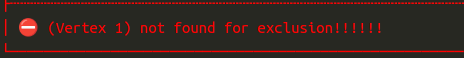
</p>

&nbsp;

&nbsp;&nbsp;&nbsp;&nbsp;Para mais informações sobre o erro ocorrido, execute a sua aplicação no modo _`debug`_ e um `log` abaixo desta mensagem de erro também será mostrado, com informações sobre a exceção lançada e o estado atual da pilha de chamadas (`StackTrace`).

&nbsp;

### **First**

&nbsp;&nbsp;&nbsp;&nbsp;Retorna o primeiro vértice da lista de vértices do grafo.

```Dart
  final myGraph = NotOrientedGraph();

  myGraph.addVertex(newVertex: Vertex(label: 'u'), connectedTo: ['v', 'x'], edgeWeight: [null, 2]);
  myGraph.addVertex(newVertex: Vertex(label: 'v'), connectedTo: ['y'], edgeWeight: []);
  myGraph.addVertex(newVertex: Vertex(label: 'y'), connectedTo: ['x'], edgeWeight: [null]);
  myGraph.addVertex(newVertex: Vertex(label: 'x'), connectedTo: ['v']);
  myGraph.addVertex(newVertex: Vertex(label: 'w'), connectedTo: ['y', 'z'], edgeWeight: [6]);
  myGraph.addVertex(newVertex: Vertex(label: 'z'), connectedTo: ['z'], edgeWeight: [8]);

  myGraph.first   // Vertex(label: 'u')
```

&nbsp;

### **Last**

&nbsp;&nbsp;&nbsp;&nbsp;Retorna o ultimo vértice da lista de vértices do grafo.

```Dart
  final myGraph = NotOrientedGraph();

  myGraph.addVertex(newVertex: Vertex(label: 'u'), connectedTo: ['v', 'x'], edgeWeight: [null, 2]);
  myGraph.addVertex(newVertex: Vertex(label: 'v'), connectedTo: ['y'], edgeWeight: []);
  myGraph.addVertex(newVertex: Vertex(label: 'y'), connectedTo: ['x'], edgeWeight: [null]);
  myGraph.addVertex(newVertex: Vertex(label: 'x'), connectedTo: ['v']);
  myGraph.addVertex(newVertex: Vertex(label: 'w'), connectedTo: ['y', 'z'], edgeWeight: [6]);
  myGraph.addVertex(newVertex: Vertex(label: 'z'), connectedTo: ['z'], edgeWeight: [8]);

  myGraph.last   // Vertex(label: 'z')
```

&nbsp;

### **Has Cycle**

&nbsp;&nbsp;&nbsp;&nbsp;Método que retorna verdadeiro se houver algum ciclo no grafo.

```Dart
  final myGraph = NotOrientedGraph();

  myGraph.addVertex(newVertex: Vertex(label: 'u'), connectedTo: ['v', 'x'], edgeWeight: [null, 2]);
  myGraph.addVertex(newVertex: Vertex(label: 'v'), connectedTo: ['y'], edgeWeight: []);
  myGraph.addVertex(newVertex: Vertex(label: 'y'), connectedTo: ['x'], edgeWeight: [null]);
  myGraph.addVertex(newVertex: Vertex(label: 'x'), connectedTo: ['v']);
  myGraph.addVertex(newVertex: Vertex(label: 'w'), connectedTo: ['y', 'z'], edgeWeight: [6]);
  myGraph.addVertex(newVertex: Vertex(label: 'z'), connectedTo: ['z'], edgeWeight: [8]);

  myGraph.hasCycle   // true
```

&nbsp;

### **Breadth First Search - Bfs**

&nbsp;&nbsp;&nbsp;&nbsp;`Busca em largura` em um grafo consiste em calcular a distância para todos os vértices alcançáveis a partir de um vértice de origem. Esse método causa um efeito colateral no grafo, gerando uma `árvore de busca em largura`.

&nbsp;&nbsp;&nbsp;&nbsp;A árvore resultante e definida através do parâmetro `ancestor` em cada vértice, no qual armazena o vértice anterior e a distância calculada e guardada em `value`. Conforme o algoritmo percorre o grafo, o parâmetro `visited` em cada vértice se torna verdadeiro.

&nbsp;

### **Depth First Search - Dfs**

&nbsp;&nbsp;&nbsp;&nbsp;`Busca em profundidade` em um grafo consiste em, a cada vértice do grafo, explorar o quanto for possível as suas listas de adjacência até ir para o próximo vértice não visitado. Esse método causa um efeito colateral no grafo, gerando uma `floresta de busca em profundidade`, ou seja, contém várias árvores de busca em profundidade.

&nbsp;&nbsp;&nbsp;&nbsp;Os parâmetros `value`, `ancestor` e `visited` armazenam a distância calculada, o vértice anterior e a identificação de visitado respectivamente.

&nbsp;

## **Métodos de um Grafo Orientado**

&nbsp;&nbsp;&nbsp;&nbsp;Grafos orientados possuem características e métodos exclusivos de sua estrutura, nas quais serão mostradas nesta sessão.

&nbsp;

### **Num of Edges**

&nbsp;&nbsp;&nbsp;&nbsp;Retorna o número de arestas presentes em um grafo orientado, somando a quantidade de arestas presente em cada vértice.

&nbsp;

### **Get all Edges**

&nbsp;&nbsp;&nbsp;&nbsp;Retorna uma lista com todas as arestas presentes em um grafo orientado.

&nbsp;

### **Is Strongly Connected**

&nbsp;&nbsp;&nbsp;&nbsp;Verifica se o grafo orientado é fortemente conexo, ou seja, se para cada par de vértices (`u`,`v`), `v` e acessível a partir de `u`

&nbsp;

<p align="center">
  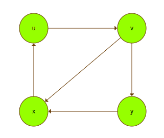
</p>

&nbsp;

### **Is DAG**

&nbsp;&nbsp;&nbsp;&nbsp;Verifica se o grafo é um DAG (grafo acíclico orientado)

&nbsp;

<p align="center">
  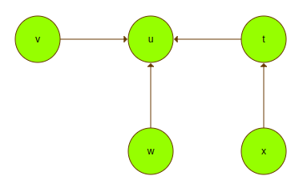
</p>

&nbsp;

### **To String**

&nbsp;&nbsp;&nbsp;&nbsp;Método no qual mostra uma versão simplificada do grafo na linha de comando utilizando `listas de adjacência`.

```Dart
    print(myGraph.toString());

    (1) -> [ (2) (3) ]
    (2) -> [ ]
    (3) -> [ ]
```

&nbsp;&nbsp;&nbsp;&nbsp;Omitindo a chamada do método _`toString()`_ dentro de _print_ também funciona:

```Dart
    print(myGraph);

    (1) -> [ (2) (3) ]
    (2) -> [ ]
    (3) -> [ ]
```

&nbsp;

### **PrintGraph**

&nbsp;&nbsp;&nbsp;&nbsp;Método mais robusto para mostrar o conteúdo de um grafo orientado na linha de comando. Mostra utilizando listas de adjacência com alguns parâmetros opcionais. Valores `nulos` não são mostrados.

```Dart
    print(myGraph.printGraph());

      (1) -----> (2)
          -----> (3)

      (2)

      (3) -----> (3)
```

&nbsp;&nbsp;&nbsp;&nbsp;Os valores associados a cada vértice podem ser mostrados com o parâmetro `vertexValue`, seguindo o padrão (`label`:`value`):

```Dart
    print(myGraph.printGraph(vertexValue: true));

      (1:5) -----> (2:4)
            -----> (3:10)

      (2:4)

      (3:10) -----> (3:10)
```

&nbsp;&nbsp;&nbsp;&nbsp;Os pesos de cada aresta também podem ser mostrados com o parâmetro `edgeWeight`:

```Dart
    print(myGraph.printGraph(edgeWeight: true));

    (1) --1--> (2)
        --2--> (3)

    (2)

    (3) --8--> (3)
```

&nbsp;

## **Métodos de um Grafo Não Orientado**

&nbsp;&nbsp;&nbsp;&nbsp;Grafos não orientados possuem características e métodos exclusivos de sua estrutura, nas quais serão mostradas nesta sessão.

&nbsp;

### **_Num of Edges_**

&nbsp;&nbsp;&nbsp;&nbsp;Retorna o número de arestas presentes em um grafo não orientado, seguindo a equação abaixo:

```Dart
  numero_total_de_vertices ~/ 2
```

&nbsp;&nbsp;&nbsp;&nbsp;pois para grafos não orientados, as arestas repetidas mas com sentido oposto são consideradas as mesmas.

&nbsp;

### **_Get all Edges_**

&nbsp;&nbsp;&nbsp;&nbsp;Retorna uma lista com todas as arestas presentes em um grafo não orientado orientado, incluindo arestas de `ida` e de `volta`.

&nbsp;

### **Is Connected**

&nbsp;&nbsp;&nbsp;&nbsp;Verifica se um grafo não orientado e conexo, ou seja, se a partir de um vértice pode-se chegar a todos os outros.

&nbsp;

<p align="center">
  
</p>

&nbsp;

### **Is Tree**

&nbsp;&nbsp;&nbsp;&nbsp;Verifica se um grafo não orientado é acíclico e conexo.

&nbsp;

<p align="center">
  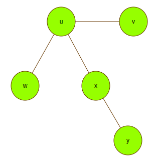
</p>

&nbsp;

### **Is Forest**

&nbsp;&nbsp;&nbsp;&nbsp;Verifica se um grafo é não orientado e acíclico

&nbsp;

<p align="center">
  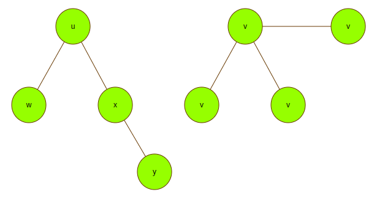
</p>

&nbsp;

### **_To String_**

&nbsp;&nbsp;&nbsp;&nbsp;Método no qual mostra uma versão simplificada do grafo na linha de comando utilizando `listas de adjacência`.

```Dart
    print(myGraph.toString());

    (1) -- [ (2) (3) ]
    (2) -- [ (1) ]
    (3) -- [ (1) ]
```

&nbsp;&nbsp;&nbsp;&nbsp;Omitindo a chamada do método _`toString()`_ dentro de _print_ também funciona:

```Dart
    print(myGraph);

    (1) -- [ (2) (3) ]
    (2) -- [ (1) ]
    (3) -- [ (1) ]
```

&nbsp;

### **_PrintGraph_**

&nbsp;&nbsp;&nbsp;&nbsp;Método mais robusto para mostrar o conteúdo de um grafo não orientado na linha de comando. Mostra utilizando listas de adjacência com alguns parâmetros opcionais. Valores `nulos` não são mostrados.

```Dart
    print(myGraph.printGraph());

    (1) ----- (2)
        ----- (3)

    (2) ----- (1)

    (3) ----- (1)
```

&nbsp;&nbsp;&nbsp;&nbsp;Os valores associados a cada vértice podem ser mostrados com o parâmetro `vertexValue`, seguindo o padrão (`label`:`value`):

```Dart
    print(myGraph.printGraph(vertexValue: true));

    (1:5) ----- (2:4)
          ----- (3:10)

    (2:4) ----- (1:5)

    (3:10) ----- (1:5)
```

&nbsp;&nbsp;&nbsp;&nbsp;Os pesos de cada aresta também podem ser mostrados com o parâmetro `edgeWeight`:

```Dart
    print(myGraph.printGraph(edgeWeight: true));

    (1) --1-- (2)
        --2-- (3)

    (2) --5-- (1)

    (3) --10-- (1)
```

&nbsp;

## **Métodos de um Vértice**

&nbsp;&nbsp;&nbsp;&nbsp;Métodos exclusivos de um vértice, alguns deles podem ser somente para grafos `orientados` e, caso sejam utilizados em grafos não orientados, uma mensagem de erro será retornada.

&nbsp;

### **Add Edge**

&nbsp;&nbsp;&nbsp;&nbsp;Cria uma nova aresta e a adiciona na lista de arestas daquele vértice.

```Dart
    final myGraph = OrientedGraph();

    myGraph.vertices.add(Vertex(label: 'u'));
    myGraph.vertices.add(Vertex(label: 'v'));

    myGraph.getV('u').addEdge(connectedTo: myGraph.getV('v'));
```

&nbsp;&nbsp;&nbsp;&nbsp;A nova aresta pode ser criada com `peso`, caso não seja passado, será `null`.

```Dart
    myGraph.getV('u').addEdge(connectedTo: myGraph.getV('v'), weight: 5);
```

&nbsp;&nbsp;&nbsp;&nbsp;Se a aresta já existir, a exceção `EdgeAlreadyExistsException` será levantada.

```Dart
  EdgeAlreadyExistsException(
    'Edge between $label and ${connectedTo.label} already exists',
  );
```

&nbsp;

### **Exclude Edge**

&nbsp;&nbsp;&nbsp;&nbsp;Remove uma aresta da lista de arestas deste vértice pelo identificador do vértice de destino.

```Dart
    final myGraph = OrientedGraph();

    myGraph.vertices.add(Vertex(label: 'u'));
    myGraph.vertices.add(Vertex(label: 'v'));

    myGraph.getV('u').addEdge(connectedTo: myGraph.getV('v'));

    myGraph.getV('u').excludeEdge('v');
```

&nbsp;&nbsp;&nbsp;&nbsp;Caso a aresta não seja encontrada no vértice, a seguinte exceção será lançada:

```Dart
  EdgeNotFoundException(
    'Edge between (vertex $label) and (vertex $destinyLabel) not found!!!!!!',
  );
```

&nbsp;

### **Vertices of Edges List**

&nbsp;&nbsp;&nbsp;&nbsp;Retorna a lista de adjacência do vértice a partir da `edgesList`.

```Dart
    final myGraph = OrientedGraph();

    myGraph.addVertex(newVertex: Vertex(label: 'u'), connectedTo: ['v', 'x']);

    myGraph.getV('u').verticesOfEdgesList   //[Vertex(label: 'v'), Vertex(label: 'x')]
```

&nbsp;

### **Is Sinkhole**

&nbsp;&nbsp;&nbsp;&nbsp;Verifica se naquele vértice há somente arestas que chegam nele, ou seja, não há arestas saindo. Válido somente para `grafos orientados`.

```Dart
    final myGraph = OrientedGraph();

    myGraph.addVertex(newVertex: Vertex(label: '1'), connectedTo: ['2', '3']);
    myGraph.addVertex(newVertex: Vertex(label: '2'));
    myGraph.addVertex(newVertex: Vertex(label: '3'));

    myGraph.getV('2').isSinkhole;   // true
    myGraph.getV('3').isSinkhole;   // true
```

&nbsp;

### **Is Generator**

&nbsp;&nbsp;&nbsp;&nbsp;Verifica se naquele vértice há somente arestas que saem dele, ou seja, não há arestas chegando. Válido somente para `grafos orientados`.

```Dart
    final myGraph = OrientedGraph();

    myGraph.addVertex(newVertex: Vertex(label: '1'), connectedTo: ['2', '3']);
    myGraph.addVertex(newVertex: Vertex(label: '2'));
    myGraph.addVertex(newVertex: Vertex(label: '3'));

    myGraph.getV('1').isSinkhole;   // true
```

&nbsp;

### **Entry Degree**

&nbsp;&nbsp;&nbsp;&nbsp;Número de arestas que `entram` no vértice.

```Dart
    final myGraph = OrientedGraph();

    myGraph.addVertex(newVertex: Vertex(label: '1'), connectedTo: ['2', '3']);
    myGraph.addVertex(newVertex: Vertex(label: '2'));
    myGraph.addVertex(newVertex: Vertex(label: '3'));

    myGraph.getV('1').entryDegree;   // 0
```

&nbsp;

### **Exit Degree**

&nbsp;&nbsp;&nbsp;&nbsp;Número de arestas que `saem` do vértice.

```Dart
    final myGraph = OrientedGraph();

    myGraph.addVertex(newVertex: Vertex(label: '1'), connectedTo: ['2', '3']);
    myGraph.addVertex(newVertex: Vertex(label: '2'));
    myGraph.addVertex(newVertex: Vertex(label: '3'));

    myGraph.getV('1').entryDegree;   // 2
```
